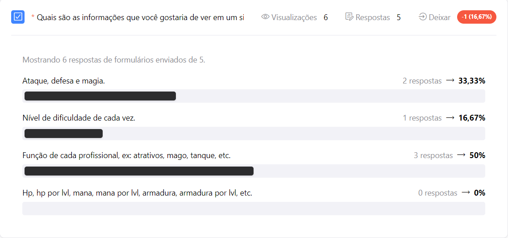
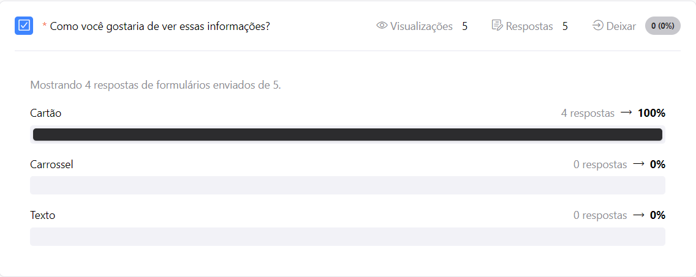
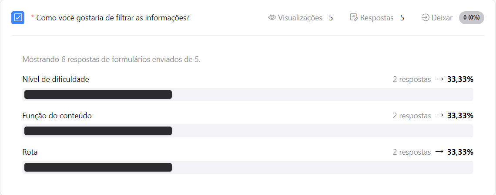
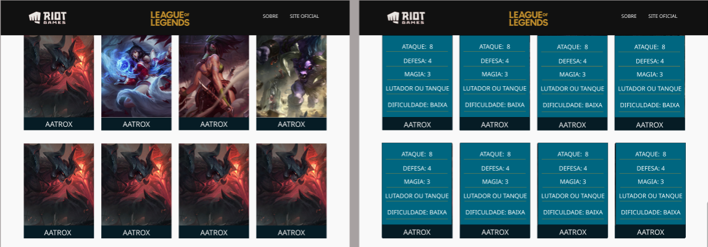
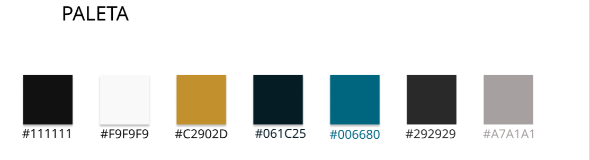

# Data Lovers - League Of Legends

## Índice

* [1. Introdução](#1-introdução)
* [2. Pesquisa de usuário](#2-pesquisa-de-usuário)
* [3. Protótipo](#3-protótipo)
* [4. Objetivos de aprendizagem](#4-objetivos-de-aprendizagem)
* [5. Checklist](#5-checklist)

***

## 1. Introdução

O projeto Data Lovers - League Of Legends tem como objetivo ajudar jogadores e novos jogadores a conhecerem melhor os campeões presentes em Summoner's Rift por meio de informações básicas como função e nível de dificuldade de cada campeão. Com base nisso, foi criada, então, uma página web que fornecesse esses dados.

## 2. Pesquisa de usuário

Para entender melhor o que o jogador de League of Legends gostaria de encontrar em um site de informações sobre os campeões do jogo, realizei uma pesquisa com três perguntas. Abaixo estão as perguntas e suas respectivas respostas.

### Pergunta 1 - Quais informações você gostaria de ver em um site sobre os campeões de League of Legends?

### Pergunta 2 - Como você gostaria de visualizar essas informações?

### Pergunta 3 - Como você gostaria de filtrar as informações?

## 3. Protótipo

A partir do resultado da pesquisa realizada com o usuário, criei o protótipo de alta fidelidade para cada tipo de tela: mobile e desktop.

### Mobile

### Desktop

### Paleta de cores
Foi utilizada, também, a seguinte paleta de cores

## 4. Objetivos de aprendizagem

Tive como objetivo de apredizagem:

### HTML

- [ ] **Uso de HTML semântico**

  * [HTML semântico](https://curriculum.laboratoria.la/pt/topics/html/02-html5/02-semantic-html)
  * [Semantics in HTML - MDN](https://developer.mozilla.org/en-US/docs/Glossary/Semantics#Semantics_in_HTML)

### CSS

- [ ] **Uso de seletores de CSS**

  * [Intro a CSS](https://curriculum.laboratoria.la/pt/topics/css/01-css/01-intro-css)
  * [CSS Selectors - MDN](https://developer.mozilla.org/pt_BR/docs/Web/CSS/CSS_Selectors)

- [ ] **Empregar o modelo de caixa (box model): borda, margem, preenchimento**

  * [Modelo de Caixa e Display](https://curriculum.laboratoria.la/pt/topics/css/01-css/02-boxmodel-and-display)
  * [The box model - MDN](https://developer.mozilla.org/en-US/docs/Learn/CSS/Building_blocks/The_box_model)
  * [Introduction to the CSS box model - MDN](https://developer.mozilla.org/en-US/docs/Web/CSS/CSS_Box_Model/Introduction_to_the_CSS_box_model)
  * [CSS display - MDN](https://developer.mozilla.org/pt-BR/docs/Web/CSS/display)
  * [display - CSS Tricks](https://css-tricks.com/almanac/properties/d/display/)

- [ ] **Uso de flexbox em CSS**

  * [A Complete Guide to Flexbox - CSS Tricks](https://css-tricks.com/snippets/css/a-guide-to-flexbox/)
  * [Flexbox Froggy](https://flexboxfroggy.com/#pt-br)
  * [Flexbox - MDN](https://developer.mozilla.org/en-US/docs/Learn/CSS/CSS_layout/Flexbox)

### Web APIs

- [ ] **Uso de seletores de DOM**

  * [Modificando o DOM](https://curriculum.laboratoria.la/pt/topics/browser/02-dom/03-1-dom-methods-selection)
  * [Introdução ao DOM - MDN](https://developer.mozilla.org/pt-BR/docs/Web/API/Document_Object_Model/Introduction)
  * [Locating DOM elements using selectors - MDN](https://developer.mozilla.org/en-US/docs/Web/API/Document_object_model/Locating_DOM_elements_using_selectors)

- [ ] **Manipulação de eventos de DOM**

  * [Introdução a eventos - MDN](https://developer.mozilla.org/pt-BR/docs/Learn/JavaScript/Building_blocks/Events)
  * [EventTarget.addEventListener() - MDN](https://developer.mozilla.org/pt-BR/docs/Web/API/EventTarget/addEventListener)
  * [EventTarget.removeEventListener() - MDN](https://developer.mozilla.org/pt-BR/docs/Web/API/EventTarget/removeEventListener)
  * [Objeto Event](https://developer.mozilla.org/pt-BR/docs/Web/API/Event)

- [ ] **Manipulação dinâmica de DOM**

  * [Introdução ao DOM](https://developer.mozilla.org/pt-BR/docs/DOM/Referencia_do_DOM/Introdu%C3%A7%C3%A3o)
  * [Node.appendChild() - MDN](https://developer.mozilla.org/pt-BR/docs/Web/API/Node/appendChild)
  * [Document.createElement() - MDN](https://developer.mozilla.org/pt-BR/docs/Web/API/Document/createElement)
  * [Document.createTextNode()](https://developer.mozilla.org/pt-BR/docs/Web/API/Document/createTextNode)
  * [Element.innerHTML - MDN](https://developer.mozilla.org/pt-BR/docs/Web/API/Element/innerHTML)
  * [Node.textContent - MDN](https://developer.mozilla.org/pt-BR/docs/Web/API/Node/textContent)

### JavaScript

- [ ] **Diferenciar entre tipos de dados primitivos e não primitivos**

- [ ] **Manipular arrays (filter, map, sort, reduce)**

  * [Arrays](https://curriculum.laboratoria.la/pt/topics/javascript/04-arrays)
  * [Array - MDN](https://developer.mozilla.org//pt-BR/docs/Web/JavaScript/Reference/Global_Objects/Array/)
  * [Array.prototype.sort() - MDN](https://developer.mozilla.org/pt-BR/docs/Web/JavaScript/Reference/Global_Objects/Array/sort)
  * [Array.prototype.forEach() - MDN](https://developer.mozilla.org/pt-BR/docs/Web/JavaScript/Reference/Global_Objects/Array/forEach)
  * [Array.prototype.map() - MDN](https://developer.mozilla.org/pt-BR/docs/Web/JavaScript/Reference/Global_Objects/Array/map)
  * [Array.prototype.filter() - MDN](https://developer.mozilla.org/pt-BR/docs/Web/JavaScript/Reference/Global_Objects/Array/filter)
  * [Array.prototype.reduce() - MDN](https://developer.mozilla.org/pt-BR/docs/Web/JavaScript/Reference/Global_Objects/Array/Reduce)

- [ ] **Manipular objects (key | value)**

  * [Objetos em JavaScript](https://curriculum.laboratoria.la/pt/topics/javascript/05-objects/01-objects)

- [ ] **Variáveis (declaração, atribuição, escopo)**

  * [Valores, tipos de dados e operadores](https://curriculum.laboratoria.la/pt/topics/javascript/01-basics/01-values-variables-and-types)
  * [Variáveis](https://curriculum.laboratoria.la/pt/topics/javascript/01-basics/02-variables)

- [ ] **Uso de condicionais (if-else, switch, operador ternário)**

  * [Estruturas condicionais e repetitivas](https://curriculum.laboratoria.la/pt/topics/javascript/02-flow-control/01-conditionals-and-loops)
  * [Tomando decisões no seu código — condicionais - MDN](https://developer.mozilla.org/pt-BR/docs/Learn/JavaScript/Building_blocks/conditionals)

- [ ] **Uso de laços (for, for..of, while)**

  * [Laços (Loops)](https://curriculum.laboratoria.la/pt/topics/javascript/02-flow-control/02-loops)
  * [Laços e iterações - MDN](https://developer.mozilla.org/pt-BR/docs/Web/JavaScript/Guide/Loops_and_iteration)

- [ ] **Uso de funções (parâmetros, argumentos, valor de retorno)**

  * [Funções (controle de fluxo)](https://curriculum.laboratoria.la/pt/topics/javascript/02-flow-control/03-functions)
  * [Funções clássicas](https://curriculum.laboratoria.la/pt/topics/javascript/03-functions/01-classic)
  * [Arrow Functions](https://curriculum.laboratoria.la/pt/topics/javascript/03-functions/02-arrow)
  * [Funções — blocos reutilizáveis de código - MDN](https://developer.mozilla.org/pt-BR/docs/Learn/JavaScript/Building_blocks/Functions)

- [ ] **Testes unitários**

  * [Introdução ao Jest - Documentação oficial](https://jestjs.io/docs/pt-BR/getting-started)

- [ ] **Módulos de ECMAScript (ES modules)**

  * [import - MDN](https://developer.mozilla.org/pt-BR/docs/Web/JavaScript/Reference/Statements/import)
  * [export - MDN](https://developer.mozilla.org/pt-BR/docs/Web/JavaScript/Reference/Statements/export)

- [ ] **Uso de linter (ESLINT)**

- [ ] **Uso de identificadores descritivos (Nomenclatura | Semântica)**

- [ ] **Diferença entre expression e statements**

### Controle de Versões (Git e GitHub)

- [ ] **Git: Instalação e configuração**

- [ ] **Git: Controle de versão com git (init, clone, add, commit, status, push, pull, remote)**

- [ ] **Git: Integração de mudanças entre ramos (branch, checkout, fetch, merge, reset, rebase, tag)**

- [ ] **GitHub: Criação de contas e repositórios, configuração de chave SSH**

- [ ] **GitHub: Implantação com GitHub Pages**

  * [Site oficial do GitHub Pages](https://pages.github.com/)

- [ ] **GitHub: Colaboração pelo Github (branches | forks | pull requests | code review | tags)**

### user-centricity

- [ ] **Desenhar a aplicação pensando e entendendo a usuária**

### product-design

- [ ] **Criar protótipos para obter feedback e iterar**

- [ ] **Aplicar os princípios de desenho visual (contraste, alinhamento, hierarquia)**

### research

- [ ] **Planejar e executar testes de usabilidade**

## 5. Checklist

* [X] Usar VanillaJS.
* [X] Passa pelo linter (`npm run pretest`)
* [X] Passa pelos testes (`npm test`)
* [X] Testes unitários cobrem um mínimo de 70% de statements, functions, lines e
  branches.
* [X] Inclui uma _definição de produto_ clara e informativa no `README.md`.
* [X] Inclui histórias de usuário no `README.md`.
* [X] Inclui rascunho da solução (protótipo de baixa fidelidade) no `README.md`.
* [ ] Inclui uma lista de problemas detectados nos testes de usabilidade no
  `README.md`.
* [X] UI: Mostra lista/tabela/etc com dados e/ou indicadores.
* [X] UI: Permite ordenar dados por um ou mais campos (asc e desc).
* [X] UI: Permite filtrar dados com base em uma condição.
* [X] UI: É _responsivo_.
